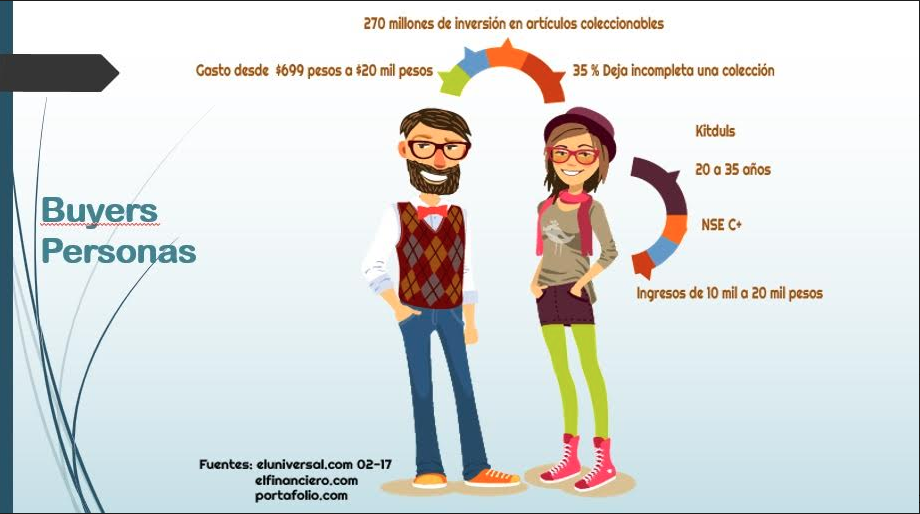
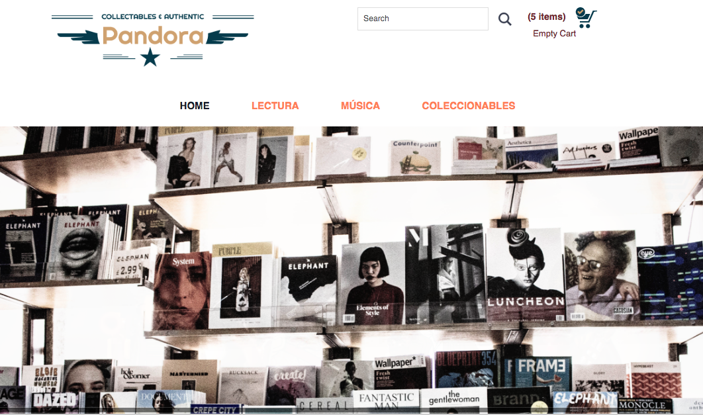
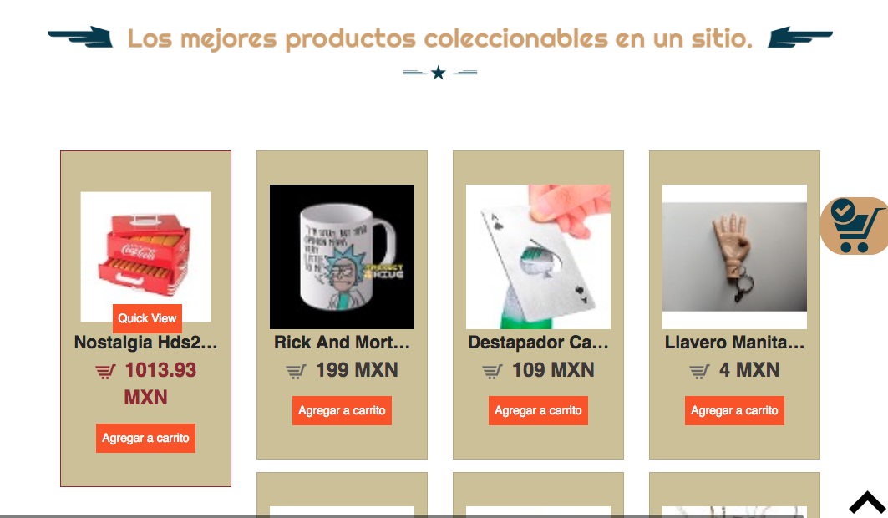
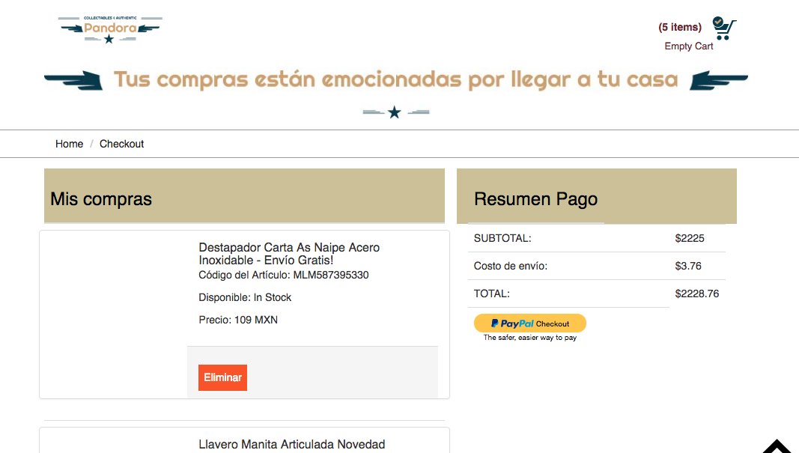

# Pandora
***

## Flujo de trabajo: El mercado de los coleccionistas es de 270 millones, con lo cual existe un mercardo potencial que va en crecimiento.

1. Identificamos el problema.

2. Descubrimos cuáles son los interes generales de nuestro target.

3. Elaboramos un check list con los lineamientos y alcances del proyecto, que se ajustarán a los tiempos de entrega.

4. Identificar los componentes que podían resolver con más aceptación la problemática del target.

## Objetivo

El reto consiste en desarrollar una solución digital, para la compra y venta de artículos de colección utilizando por menos dos apis, en nuestro caso mercado libre y paypal:

## Detalles adicionales

Para el proceso del desarrollo de la idea se utilizó la técnica de Desing Thinking

1. Empatizar (Observar - Involucarnos -Escuchar)

2. Definir (Organizamos la información para determinar el problema para enfocarlo y determinar el éxito del proyecto Point Of View POV)

3. Idea (brainstorming)

4. Prototipamos (Elaboramos los bocetos de la idea

5. Probar (Evaluamos con el usuario si la solución presentada cumplia su objetivo).  

## Consideraciones generales

Este reto se utilizaron las siguientes herramientas, materiales y fuentes:

- Trello para administra el proyecto y la definición de objetivos.

- Articulos diversos para conocer más sobre nuestro target.

